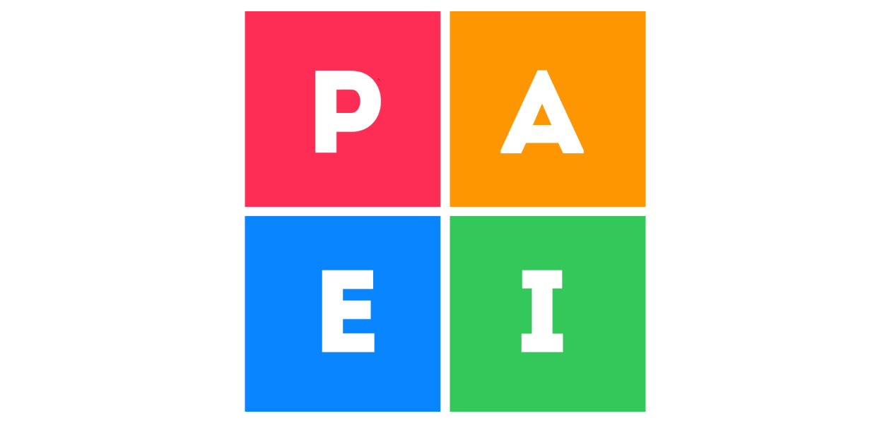

### iOS Приложение Тест PAEI

Приложение может вам определить свой стиль менеджмента, а также поделиться подробной характеристикой с коллегами или работодателем.

В книге "Идеальный руководитель" Ицхак Адизес представляет модель PAEI – которая описывает 4 управленческих роли, выполнение каждой из них помогает команде или организации обеспечить максимально эффективную деятельность. Это: 

- Производитель. 
- Администратор. 
- Предприниматель. 
- Интегратор. 

Ни один человек не может одновременно выполнять все эти роли. Важно сделать так, чтобы всегда был кто-то, кто отвечает за каждую из них; тогда вы сможете построить сильную и эффективную команду менеджеров, которые выполняют свои обязанности и задачи.

Модель PAEI разработал Ицхак Адизес (יצחק אדיג'ס‏‎) – израильский и американский писатель и бизнес-консультант, специализирующийся на улучшении эффективности менеджмента.

Оригинальный тест вы можете пройти на [сайте института Адизеса](https://adizes.me).

### Обратная связь

Если у вас возникли какие-то вопросы, проблемы или предложения по развитию iOS приложения Тест PAEI, вы можете [связаться с разработчиком](mailto:ageres7@gmail.com?subject=WeatherTV%20Support) и получить ответ в кратчайшие сроки.

С уважением, 
Сергей Долгих